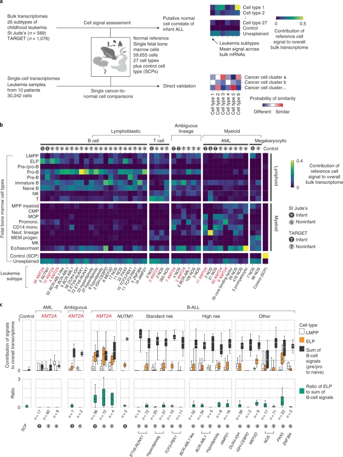

# Title
Recapitulating the contribution of reference cell signals to the overall transcriptome of leukemic bone marrow samples.

# Paper title
Single-cell transcriptomics reveals a distinct developmental state of KMT2A-rearranged infant B-cell acute lymphoblastic leukemia: https://www.nature.com/articles/s41591-022-01720-7#data-availability

# Description: 
Our project involves recreating data from a study that assessed the differentiation status of KMT2A-rearranged infant ALL from bulk and single-cell transcriptome data. Our goal is to replicate heatmaps and box plots showing fetal bone marrow cell signals in leukemia subtypes and validate these signals by comparing cancer and normal cells.

# Example published figure: 

# Datasets with IDs, links:
GEO for bulk RNA sequencing data: GSE122982
IDs of scRNA seq data from developing bone marrow: E-MTAB-9389 and ERP125305

# Software with versions, links: 

# 2-3 proposed steps, with first doable <5 hours and the other 2 being a stretch:
- Access scRNA data, visualize, organize data we need 
- Analyze B-cell to T-cell ratio from single cell data based on known markers. See if the ratios they found in control populations match ratios found in the broader literature.
- Fit RNA seq data to the reference human genome to see which genes are expressed and where SNPs are present.
- Try to recreate the figure 1b of the paper.

