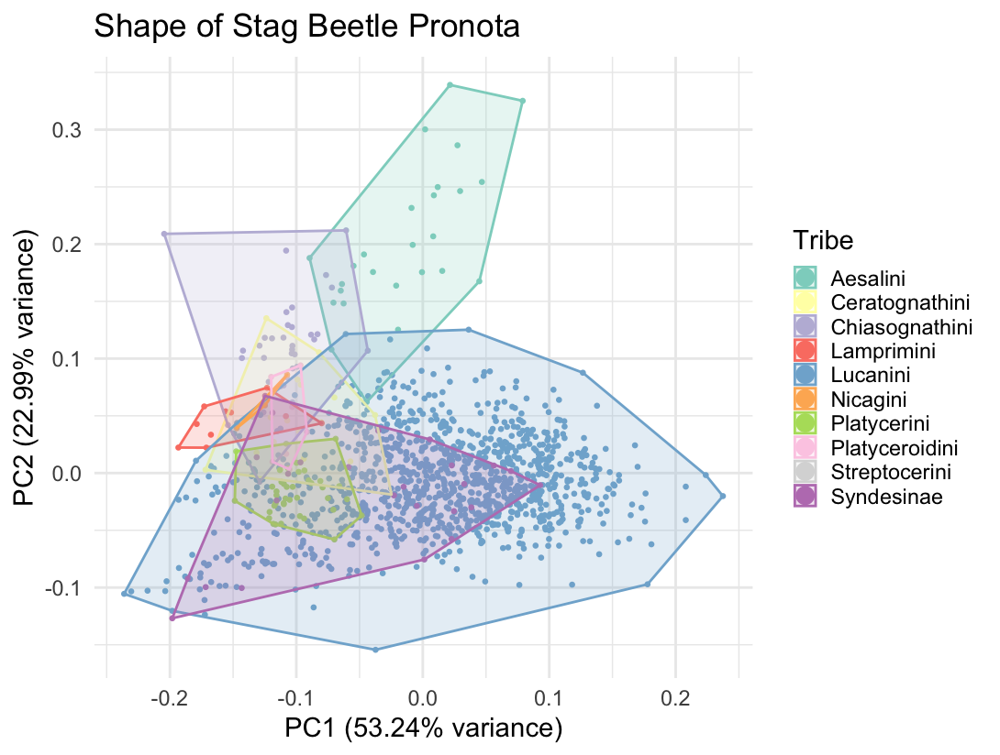
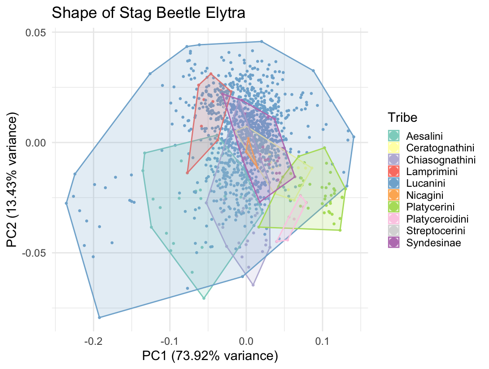

# Addressing prior feedback
- We took Fred's feedback and appended our proposal to clarify software we will be using (ggplot, dplyr, geomorph) and clarified how the work will be split up. Rashad will organize the data and make PCA plots while Sara will run statistical analysis on our GPA across different groups. There will be a lot to dig into there.

# Progress since last submission
- Pushed organized data (Pronotum.TPS + Elytron.TPS) to github along with the code involved in organizing it (Protum_workflow.R + Elytron_workflow.R).
- Ran GPA and generated PCA plots for elytron and pronotum:

# Project organization
- With GPAs run and PCAs made we can run statistical tests like ANOVA to detect significant differences in shape across different groups of beetles. We can also cross-reference our results with a phylogeny to see what patterns or interesting data emerge.
- We also want to be able to plot the landmarks from pronota and elytra of individual beetles to get an idea of what changes each PC is visually describing. Looking into interactive plot packages in R for this.

# Struggles
- Many struggles have come up and been worked through up to this point, but a big one going forward might be that we need some direction regarding how to analyze our data. We have a good idea of how to move forward but there is so much to dig into that we might need some advice so we can stay directed.